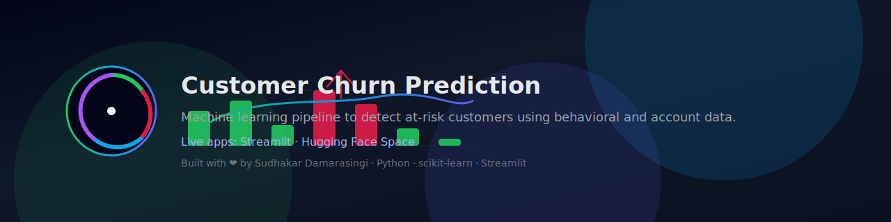

<p align="center">
  
</p>


<p align="center">
  
</p>

<p align="center">
  <a href="https://sudhakardamarasingi.streamlit.app/">
    
  </a>
  <a href="https://huggingface.co/spaces/Madmax003/churn_prediction2">
    
  </a>
  
  
  
</p>

---

# 📊 Customer Churn Prediction

This project is an **end-to-end Machine Learning application** that predicts whether a customer is likely to **churn (leave a service)** based on historical behavior and account information.

It is designed to help businesses:

- Identify **high-risk customers**
- Take **proactive retention actions**
- Understand **drivers of churn** using model insights

You can try the live app here:

- 🚀 **Streamlit App** → [Customer Churn Prediction](https://sudhakardamarasingi.streamlit.app/)  
- 🤗 **Hugging Face Space** → [Churn Prediction Space](https://huggingface.co/spaces/Madmax003/churn_prediction2)

---

## 🧠 Problem Statement

Customer churn is a critical issue for subscription-based and service-based businesses.  
Acquiring a new customer is often **more expensive** than retaining an existing one.

This project builds a **classification model** that predicts whether a customer will churn based on:

- Demographics  
- Services subscribed  
- Tenure  
- Billing and payment patterns  
- Usage and engagement signals  

---

## 🧱 Project Structure

```bash
.
├── app.py                  # Streamlit / Flask app for serving predictions
├── churn_dataset.csv       # Dataset used for training and evaluation
├── advanced_churn_model.pkl# Trained ML model (serialized)
├── requirements.txt        # Python dependencies
├── README.md               # Project documentation
├── LICENSE                 # License (MIT)
└── .gitignore              # Git ignore rules
